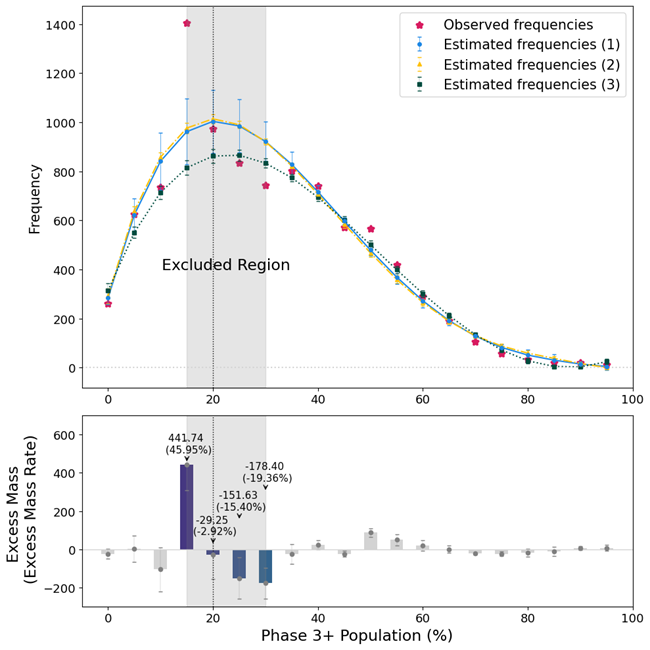
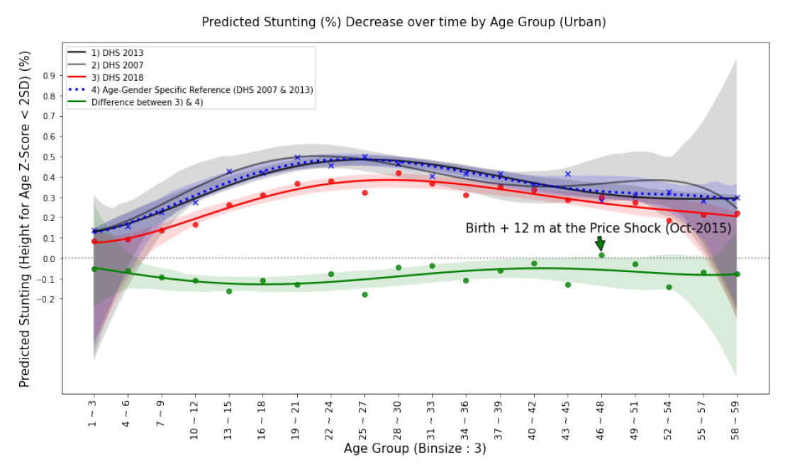

**Abstract**: This study sheds light on a critical challenge for global humanitarian efforts: delivering timely, targeted aid to regions facing acute food insecurity. As hunger intensifies worldwide, the Integrated Food Security Phase Classification (IPC) system plays a pivotal role, alerting the world to regions in crisis and directing billions in relief aid to those in dire need. Yet, a fundamental question remains—does the IPC mobilize aid with the speed and precision necessary to meet escalating needs? Focusing on Afghanistan, a priority IPC country, this study introduces a novel dataset that aligns humanitarian funding flows with IPC regional classifications. Utilizing a staggered Difference-in-Differences approach, I investigate how IPC phase escalations impact immediate aid responses. The findings reveal a significant but insufficient increase in funding following transitions to IPC Phase 4, underscoring the gap between current aid allocations and the critical needs of populations facing severe food insecurity. This research offers a first-of-its-kind subnational analysis of IPC-driven aid allocation, providing policymakers with essential insights to strengthen future humanitarian response efforts. The study highlights the importance of more effective aid allocation and improved communication strategies to ensure that humanitarian assistance reaches those in need swiftly and accurately.

[📄 Link to Draft](https://uofi.box.com/s/0mni5hwk1v2mk9yw095nhkgdv0wmpakv)

---
title: "Global Population of Acutely Hungry is Underestimated by ¼, with E. Lentz, H. Michelson, and K. Baylis (Under Review)"
excerpt: "Is the current global acute hunger measurement system (IPC) accurate? "
collection: portfolio
---
**Abstract**: Acute hunger affects hundreds of millions of people worldwide with long-term consequences for health, development and security. The Integrated Food Security Phase Classification (IPC) system is the global method for classifying food insecurity severity and is used to allocate more than six billion dollars of humanitarian food assistance annually. Despite concerns that IPC estimates overstate globally food insecurity, our analysis of data from 2.8 billion people between 2017-2023 shows the opposite. We find that IPC assessments underestimate the number of acutely hungry people in the world, missing one in four. Using a non-parametric statistical approach, we find evidence of bunching or under-classification around the threshold that differentiates areas classified as ‘stressed’ from those ‘in crisis’—a critical threshold intended to trigger humanitarian funding. Contrary to widely held assumptions, our findings suggest that the prevalence and severity of acute hunger is significantly higher than current global estimates.

[📄 Link to Draft](https://uofi.box.com/s/v2tylljea7plookmep4im18tm4c77clh)
[💻 Link to Replication Code](https://github.com/mnmx0101/IPC_Paper)

---
title: "Early-Year Milk Price and Child Stunting in Zambia, with K. Baylis"
excerpt: "Does Early-Year Milk Price increase Child Malnutrition? "
collection: portfolio
---
**Abstract**: Zambia experienced a sharp rise in food prices in late 2015. In this study, we construct a novel dataset by integrating historical food price data with the most recent Zambia Demographic and Health Survey (DHS) from 2018. We examine the relationship between early-life food prices (e.g., fresh milk and mealie meal) and under-five child stunting in Zambia, while accounting for child-level characteristics and household fixed effects. Our findings suggest that elevated milk prices during the early years of life (12 to 24 months) are a significant risk factor for stunting among children aged 24 to 59 months, particularly those who completed their first two years of life. The effect is especially pronounced in urban areas, particularly among the poorest and middle-income groups, whose milk consumption rates are relatively high, excluding the wealthiest group. This study contributes to the literature by empirically identifying the critical timing at which price shocks in nutrient-dense foods contribute to stunting. It highlights both the most vulnerable groups during price shocks and the optimal timing for interventions to mitigate the risk of stunting.

[📄Link to Draft](https://uofi.box.com/s/vgameizo3rivde5isa01kol7mhjwa59s)

---
