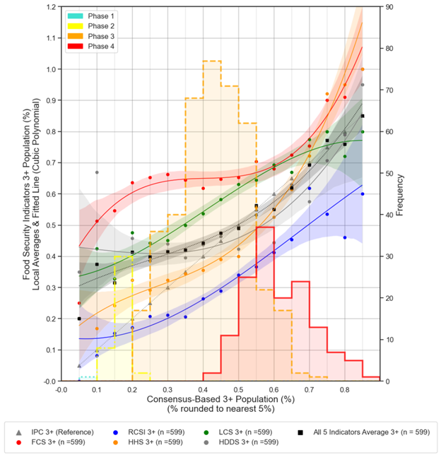

[🧾 Working Papers](#working-papers)  &#124;  [📘 Publications](#publications-peer-reviewed)  &#124; [🔬 Work-In-Progress](#work-in-progress)

<h2 style="text-align: center;">🧾 Working Papers</h2>

### **Hidden Hunger: Global Population of Acutely Hungry is Underestimated by ¼** (Revise & Resubmit, Nature Food)
*with E. Lentz, H. Michelson, K. Baylis*

.png)  
[*Link to draft*](https://uofi.app.box.com/file/1688331946836?s=v2tylljea7plookmep4im18tm4c77clh) | [*Replication Code*](https://github.com/mnmx0101/IPC_Paper)

Click to view abstract

Acute hunger affects hundreds of millions of people worldwide with long-term consequences for health, development and security. The Integrated Food Security Phase Classification (IPC) system is the global method for classifying food insecurity severity and is used to allocate more than six billion dollars of humanitarian food assistance annually. Despite concerns that IPC estimates overstate globally food insecurity, our analysis of data from 2.8 billion people between 2017–2023 shows the opposite. We find that IPC assessments underestimate the number of acutely hungry people in the world, missing one in four. Using a non-parametric statistical approach, we find evidence of bunching or under-classification around the threshold that differentiates areas classified as ‘stressed’ from those ‘in crisis’—a critical threshold intended to trigger humanitarian funding. Contrary to widely held assumptions, our findings suggest that the prevalence and severity of acute hunger is significantly higher than current global estimates.

### **From Food Crisis to Resource Allocation: Tracking Humanitarian Aid in Afghanistan** (Job Market Paper)
.png)  
[*Link to draft*](https://uofi.app.box.com/file/1716072760356?s=q0oxfiytwzgzziogdyc60mmc7p40co5t) | [*Link to slides*](../files/ipc_aid_slides.pdf)

Click to view abstract

This study sheds light on a critical challenge for global humanitarian efforts: delivering timely, targeted aid to regions facing acute food insecurity. As hunger intensifies worldwide, the Integrated Food Security Phase Classification (IPC) system plays a pivotal role, alerting the world to regions in crisis and directing billions in relief aid to those in dire need. Yet, a fundamental question remains—does the IPC mobilize aid with the speed and precision necessary to meet escalating needs? Focusing on Afghanistan, a priority IPC country, this study introduces a novel dataset that aligns humanitarian funding flows with IPC regional classifications. Utilizing a staggered Difference-in-Differences approach, I investigate how IPC phase escalations impact immediate aid responses. The findings reveal a significant but insufficient increase in funding following transitions to IPC Phase 4, underscoring the gap between current aid allocations and the critical needs of populations facing severe food insecurity. This research offers a first-of-its-kind subnational analysis of IPC-driven aid allocation, providing policymakers with essential insights to strengthen future humanitarian response efforts.

### **Inside the black box: how consistent are global food security crisis assessments**  (Revise & Resubmit, Food Policy) 
*with E. Lentz, H. Michelson, K. Baylis*

Click to view abstract

The world relies on assessments by the United Nations-facilitated Integrated Food Security Phase Classification (IPC) to identify where populations are most food insecure and to quantify the severity of these situations. IPC sub-national assessments are designed to be comparable over space and time in the 30 countries in which they operate. Humanitarian agencies appear to treat these assessments as authoritative and comparable, relying on IPC classifications to allocate more than six billion dollars of aid globally and annuallyper year. In this paper, we study whether IPC food insecurity classifications are indeed consistent and comparable across time and space. Analyzing 1,881 IPC classifications from fifteen countries between 2019 and 2023, we show that the IPC technical working groups who make IPC assessments face recurring and significant challenges related to data and food security measurement, resulting from often discordant underlying food security data. These data and measurement challenges make achieving consistency challenging, underscoring both the fundamental difficulty of food security classifications and the value of the IPC process, which is based on achieving consensus among trained experts based on available data and contextual information. We find that the vast majority of classifications are consistent with IPC technical guidance, but that this guidance allows for a wide range of classifications . We also find evidence that IPC technical working groups differ in the way that they rely on available food security data, often weighing food security indicators differently in different locations. Though variation in the way in which how the food security indicators are used to make assessments can reflect different sets of evidence and contexts, we also find that working groups even weigh indicators differently across time for the same location. Further, TWGs do not treat closely correlated food security indicators as substitutes, suggesting some inconsistency in the treatment of food security indicators across assessments. We discuss implications of these findings for policy and for the use of IPC assessments in research.

### **Early-Year Milk Prices and Child Stunting in Zambia** (Ready for Submission)
*with K. Baylis*
.png)  
**Selected Presentation** at the American Agricultural Economics Association 2022, European Association of Agricultural Economists 2023, Tata-Cornell Institute for Agriculture and Nutrition 2023

[*Link to draft*](https://uofi.box.com/s/vgameizo3rivde5isa01kol7mhjwa59s)  &#124; [*Presentation Slides*](https://uofi.box.com/s/qiodej02vq9nx5nsvyc0jzn9qwxbyjhv)

Click to view abstract

Zambia experienced a sharp rise in food prices in late 2015. In this study, we construct a novel dataset by integrating historical food price data with the most recent Zambia Demographic and Health Survey (DHS) from 2018. We examine the relationship between early-life food prices (e.g., fresh milk and mealie meal) and under-five child stunting in Zambia, while accounting for child-level characteristics and household fixed effects. Our findings suggest that elevated milk prices during the early years of life (12 to 24 months) are a significant risk factor for stunting among children aged 24 to 59 months, particularly those who completed their first two years of life. The effect is especially pronounced in urban areas, particularly among the poorest and middle-income groups, whose milk consumption rates are relatively high, excluding the wealthiest group. This study contributes to the literature by empirically identifying the critical timing at which price shocks in nutrient-dense foods contribute to stunting. It highlights both the most vulnerable groups during price shocks and the optimal timing for interventions to mitigate the risk of stunting.

<h2 style="text-align: center;">📘 Publications (Peer-Reviewed)</h2>

### **Machine Learning for Food Security: Principles for Transparency and Usability**  
*Applied Economic Perspectives and Policy, 2022* 
*Authors:* Y. Zhou, E. Lentz, H. Michelson, **_C. Kim_**, K. Baylis  
*DOI:* [https://doi.org/10.1002/aepp.13214](https://doi.org/10.1002/aepp.13214)

Click to view abstract

Machine learning (ML) holds potential to predict hunger crises before they occur. Yet, ML models embed crucial choices that affect their utility. We develop a prototype model to predict food insecurity across three countries in sub-Saharan Africa. Readily available data on prices, assets, and weather all influence our model predictions. Our model obtains 55%–84% accuracy, substantially outperforming both a logit and ML models using only time and location. We highlight key principles for transparency and demonstrate how modeling choices between recall and accuracy can be tailored to policy-maker needs. Our work provides a path for future modeling efforts in this area.

### **Exploring the Association between Agricultural Production Systems and Household Diets in Viet Nam**  
*Food Security, 2022* 
*Authors:* A. Bandyopadhyay, C. Azzarri, B. Haile, **_C. Kim_**, C. Alvarez, A. Moltedo, A. Sattar, W. Bell, B. Rogers  
*DOI:* [https://10.1007/s12571-022-01276-x](https://link.springer.com/article/10.1007/s12571-022-01276-x)

Click to view abstract

The government of Viet Nam promotes an integrated and diversified production system that focuses on the symbiotic relationship of livestock, aquaculture, and fruits and vegetables (F&V), locally known as Vuon Ao Chuong (VAC). The expectation is that this system can prevent soil degradation, while improving dietary quality and income. This study examines the correlation between VAC production systems and diets using cross-sectional data from the 2016 round of the Viet Nam Household Living Standards Survey (VHLSS). Using ordinary least squares, we model four continuous outcome variables related to quantity consumed of fruits and vegetables, fiber, animal protein, and dietary energy; while using logistical regression, we model three indicator variables related to whether diets are balanced in terms of intake of dietary energy derived from carbohydrates, proteins, and fats. While individual components of VAC, such as aquaculture or F&V production, show a positive correlation with one or more dietary indicators, adoption of the full VAC system is found to be positively correlated only with dietary fiber consumption, making it challenging to establish a causal link between system adoption and improved dietary quality. However, we find that several socioeconomic variables, such as access to markets, household wealth, education of the household members, and household size are positively associated with one or more dietary indicators. Further research is needed to establish strong and causal relationships, or lack thereof, between VAC system and diets by exploiting the panel structure of VHLSS to examine the role of VAC in improving nutritional outcomes in Viet Nam.

### **The Economics of the Soy Kit as an Appropriate Household Technology for Food Entrepreneurs**  
 *Food and Nutrition Bulletin, 2021*  
*Authors:* **_C. Kim_**, P. Goldsmith  
*DOI:* [https://doi.org/10.1177/0379572120981183](https://doi.org/10.1177/0379572120981183)

Click to view abstract

The ability for women to operate as food entrepreneurs presents opportunities to leverage at-home production technologies that not only support family nutrition but also generate income. To these ends, the Feed the Future Malawi Agriculture Diversification Activity recently launched a development project involving a new technology, the Soy Kit. The Activity, a USAID (United States Agency for International Development) funded effort, sought to improve nutrition utilizing an underutilized local and highly nutritious feedstuff, soybean, through a woman’s entrepreneurship scheme.

### **Vietnamese Preferences for Fresh Korean Ginseng with Labels of Certification, Nationality, Private Brands, and Shopping Places** 
 *Korean Agricultural Economics Associatio, 2021* 
*Authors:* Y. Joo, T. Kim, DK. Nguyen, **C. Kim**  
*DOI:* [https://doi.org/10.24997/KJAE.2021.62.3.177](https://doi.org/10.24997/KJAE.2021.62.3.177)

Click to view abstract

Fresh Korean ginseng needs more credibility in the Vietnam market since fresh ginseng imported from China is increasing, and the Vietnam government promotes its national Ngoc Linh ginseng brand. Therefore, this study determines factors of three shopping places (the department store, supermarket, and ginseng specialty store), the certification label of good agriculture products (Viet GAP), Korean nationality, and three famous private brands of CheongKwanJang, HanSamIn, and Geumhong affecting Vietnamese consumers fresh ginseng choices based on 897 respondents from Hanoi and Hochiminh City in January 2018. Conditional and random parameter logits are used to find differences in the independent assumptions relaxation among irrelevant alternatives. Hausman test for IIA assumptions holds for the choice of the department store, ginseng specialty store, and None. Overall results show that shopping places, the Korean national flag, and the existence of VietGap positively affect Vietnam consumers choices. However, none of the Korean private brands could significantly affect Vietnamese choice for fresh ginseng products. The shopping place of ginseng specialty stores gets the highest WTP, followed by supermarkets and department stores. Korean national flag also shows a high WTP, which is higher than Vietgap, a certificate from Vietnam agricultural products. Female consumers tend to pay more WTP than males. Hochiminh consumers are willing to pay more than Hanoi consumers on average. Of course, the high-income consumers tend to pay more WTP than the low-income group. However, the low-income groups still demand fresh ginseng at a significant price. Understanding different price effects by consumer groups seem helpful for small and medium enterprises to market their ginseng products into Vietnam by further considering the origin of Korean nationality.

<h2 style="text-align: center;">🔬 Work-In-Progress</h2>

### **Multidimensional Food Security Dynamics in Sub-Saharan Africa**  
<iframe src="../images/multi_fi_malawi.html" 
        width="150%" 
        height="600" 
        frameborder="0.5">
</iframe>

Click to view abstract

This study investigates how commonly used food security indicators—such as the Food Consumption Score (FCS), the Reduced Coping Strategies Index (rCSI), and an asset index—diverge in identifying food-insecure households. Using household survey data, we analyze the extent of overlap and discordance across these measures and examine the demographic and economic factors associated with each classification. Our findings highlight the multidimensional nature of food insecurity and underscore the importance of indicator choice for targeting, policy design, and program effectiveness.

### **Operational and actionable Acute Food Insecurity modelling**  
*w/* M. Ronco (JRC.E1), M. Machefer (JRC.D5), A. Matano (VU Amsterdam), D. Piovani (WFP), M. Meroni, J. M. Veiga Lopez-Pena (JRC.D5), C. Corbane (JRC.E1), F. Rembold (JRC.D5)​ 

Click to view abstract

This study presents a comprehensive review of modeling approaches for Acute Food Insecurity (AFI), bridging the gap between food security experts and the machine learning community. We evaluate several machine learning approaches for forecasting food crises up to three months in advance and for identifying historical drivers behind AFI conditions used in IPC/CH and FEWS NET systems. We introduce a benchmark dataset that is global, frequently updated, and disaggregated to monthly and admin-2 levels. This dataset enables institutional collaboration, supports reproducible research, and facilitates model development focused on both accuracy and explainability.

