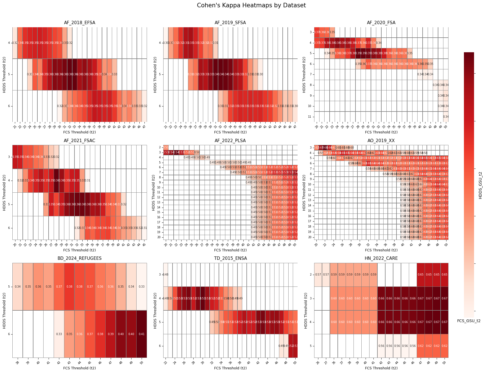
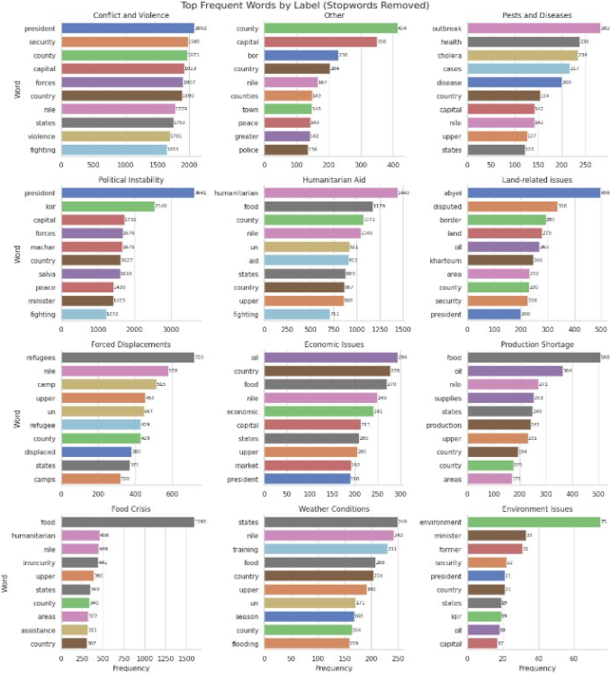

### **Optimizing Classification Thresholds for Food Security Indicators: A Data-Driven Evaluation Across 26 Countries (2025)** 
*with M. Mizutani (FAO)*
  

Click to view abstract

This project presents a data-driven approach to optimize classification thresholds used in food security monitoring systems. By evaluating pairwise concordance and agreement metrics across multiple indicators, the method seeks to enhance consistency and alignment between measurement tools. The analysis leverages a harmonized dataset of over 100 household surveys, covering more than 780,000 households across the globe and spanning 26 countries. For each dataset, all valid threshold combinations are tested to identify those that maximize both Cohen’s Kappa and simple agreement scores, with additional attention to agreement by category. This approach supports the refinement of current cutoffs, aiming to improve the reliability and comparability of food security classifications for decision-makers and analysts alike.

### **Unstructured News as Structured Risk: A Media-Based Pipeline for Anticipating Crises (2025)** 
*with C. van Wanrooij (Kickstart AI)*

[*Link to draft*](../files/ipc_news_monitoring.pdf)   

Click to view abstract

Timely detection of food insecurity remains a critical challenge, particularly in fragile contexts where conventional data streams suffer from delays, sparsity, or limited geographic granularity. This study presents a novel media analytics system designed to extract high-frequency early warning signals of food security risks from unstructured news text. Leveraging advances in natural language processing—including transformer-based sentiment analysis and unsupervised topic modeling (BERTopic)—the system processes scraped news articles through a pipeline of geoparsing, thematic classification, and temporal aggregation. The resulting indicators are aligned with the IPC (Integrated Food Security Phase Classification) framework and integrated into the IPC’s Risk Analysis and Attribution Platform (RAAp) as complementary signals. Drawing from a corpus of over 18,000 articles (2011–2023), including over 11,000 geo-tagged at subnational level, the pipeline identifies media trends in topics such as conflict, drought, displacement, and market shocks. Preliminary validation against historical IPC outcomes demonstrates that media-derived indicators can anticipate food security phase transitions with lead times exceeding those of traditional predictors. This research contributes to the growing field of data-driven humanitarian early warning by operationalizing media text as a cost-effective, scalable proxy for latent risk dynamics. It further extends the literature on machine learning for crisis forecasting, supporting calls for integrating alternative data sources into established food security assessment systems.

### **IPC Accuracy Study: Analyzing the Internal Consistency of IPC AFI and AMN Analyses (2024)**  
*IPC Global Support Unit, 2024*  
*Authors:* E. Lentz, K. Baylis, H. Michelson, **_C. Kim_**  
[View Report](https://www.ipcinfo.org/fileadmin/user_upload/ipcinfo/docs/IPC_Accuracy_Study.pdf)

Click to view abstract

This report evaluates the internal consistency of IPC Acute Food Insecurity (AFI) and Acute Malnutrition (AMN) classifications across multiple country contexts. It highlights key methodological and operational issues affecting classification accuracy and offers recommendations for strengthening the reliability of IPC assessments.

---

### **Production, Consumption, and Food Security in Viet Nam: Diagnostic Overview (2021)**  
*International Food Policy Research Institute (IFPRI), 2021*  
*Authors:* **_C. Kim_**, C. Alvarez, A. Sattar, A. Bandyopadhyay, C. Azzarri, A. Moltedo, B. Haile  
[View Report](https://inddex.nutrition.tufts.edu/sites/default/files/Vietnam%20Diagnostic%20Overview%20Sept%2023%5B1%5D.pdf)

Click to view abstract

This diagnostic report provides an overview of the linkages between agricultural production, food consumption, and food security in Vietnam. It synthesizes key food security and nutrition indicators and challenges to inform evidence-based interventions and strategic planning by policymakers and development partners.

---

### **Mapping of Poultry Hotspots in Tanzania (2018)**  
*IFPRI Technical Note, 2018*  
*Authors:* J. Koo, **_C. Kim_**  
[View Report](https://cgspace.cgiar.org/server/api/core/bitstreams/a30ccaad-7abb-4ca7-be7e-37ca9d158e82/content)

Click to view abstract

This technical note maps spatial hotspots for poultry production in Tanzania. Using geospatial and market data, it identifies key regions for scaling poultry-related development programs and highlights constraints in infrastructure, disease control, and access to inputs.

---